# 🚀 CanadaGoose - Full-Stack Personal Finance Tracker

A modern, secure full-stack web application built with Vue 3 frontend and Express.js backend, featuring comprehensive CI/CD deployment automation and production-ready infrastructure.

## 🏗️ Project Structure

```
/CanadaGoose
├── /client                    # Vue 3 frontend (Vite + Tailwind + TypeScript)
│   ├── /src
│   │   ├── /views            # Vue components (Home, Dashboard, Login, Signup, Profile, Financial)
│   │   ├── /components       # Reusable UI components
│   │   ├── /stores           # Pinia state management
│   │   ├── /router           # Vue Router configuration
│   │   ├── /services         # API services and utilities
│   │   └── /assets           # Styles and static assets
│   ├── /cypress              # E2E testing with Cypress
│   ├── /selenium             # Cross-browser testing with Selenium
│   ├── /scripts              # Build and deployment scripts
│   └── /dist                 # Production build output
├── /server                    # Express.js backend with security features
│   ├── /routes               # API endpoints (auth, financial, logs)
│   ├── /middleware           # Security middleware (auth, rate limiting, password policy)
│   ├── /config               # Database and logging configuration
│   ├── /database             # Database initialization scripts
│   ├── /scripts              # Production deployment scripts
│   ├── /serverDocs           # Server documentation and guides
│   └── /test                 # Backend testing (Mocha/Chai)
├── /infra                     # Terraform infrastructure as code
│   ├── /server-scripts       # EC2 server management scripts
│   └── terraform files       # AWS infrastructure configuration
└── docker-compose.yml         # Local development environment
```

## 🚀 Quick Start

### Prerequisites

- **Node.js 20+** (for both frontend and backend)
- **Docker & Docker Compose** (for local database)
- **Git** (for version control)
- **AWS CLI** (for production deployment)

### Development Setup

1. **Clone and setup:**

   ```bash
   git clone <your-repo>
   cd CanadaGoose
   ```

2. **Start local database:**

   ```bash
   docker-compose up -d
   ```

3. **Backend setup:**

   ```bash
   cd server
   npm install
   cp env.example .env
   # Edit .env with your database credentials
   npm run dev
   ```

4. **Frontend setup:**

   ```bash
   cd ../client
   npm install
   npm run dev
   ```

5. **Run tests:**

   ```bash
   # Backend tests
   cd server && npm test

   # Frontend unit tests
   cd ../client && npm run test:unit

   # Frontend E2E tests
   cd ../client && npm run cypress:open
   ```

## 🧱 Tech Stack

### Frontend (Vue 3 + TypeScript)

- **Framework**: Vue 3 with Composition API
- **Build Tool**: Vite 7.0
- **Language**: TypeScript 5.8
- **Styling**: Tailwind CSS 3.4 + PostCSS
- **State Management**: Pinia 3.0
- **Routing**: Vue Router 4.5
- **HTTP Client**: Axios 1.10
- **Icons**: Lucide Vue Next
- **Testing**: Vitest (unit), Cypress (E2E), Selenium (cross-browser)
- **Code Quality**: ESLint, Prettier, TypeScript strict mode

### Backend (Node.js + Express)

- **Runtime**: Node.js 20+
- **Framework**: Express.js 4.21
- **Authentication**: JWT + bcryptjs
- **Security**: Helmet, CORS, Rate Limiting
- **Validation**: Joi schema validation
- **Database**: MySQL2 with connection pooling
- **Testing**: Mocha + Chai + Supertest
- **Code Coverage**: NYC (Istanbul)
- **Logging**: CloudWatch integration

### Infrastructure & DevOps

- **Infrastructure**: Terraform + AWS
- **Compute**: EC2 with PM2 process management
- **Database**: RDS MySQL with enhanced security
- **Web Server**: Nginx reverse proxy
- **CI/CD**: GitHub Actions + Automated deployment scripts
- **Monitoring**: PM2 ecosystem + CloudWatch + health checks

## 🔐 Security Features

- ✅ **JWT Authentication** with secure token management
- ✅ **Password Policies** (8+ chars, complexity requirements)
- ✅ **Rate Limiting** (5 attempts/15min for API endpoints)
- ✅ **Security Headers** via Helmet middleware
- ✅ **CORS Protection** with configurable origins
- ✅ **Input Validation** using Joi schemas
- ✅ **SQL Injection Protection** via parameterized queries
- ✅ **Environment Variable Security** with .env files
- ✅ **Account Lockout** after multiple failed login attempts

## 💰 Financial Features

- ✅ **Transaction Management** - Add, edit, delete financial transactions
- ✅ **Category System** - Organize transactions by categories
- ✅ **Date Tracking** - Record transaction dates and times
- ✅ **Amount Validation** - Support for decimal amounts
- ✅ **Database Persistence** - Secure MySQL storage
- ✅ **API Endpoints** - RESTful API for financial operations

### Frontend Screenshots

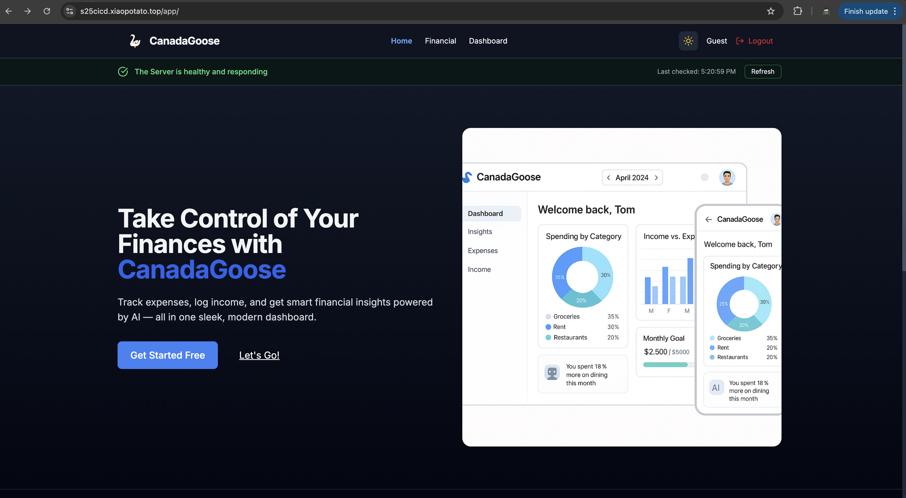
_Main application homepage with modern UI design_

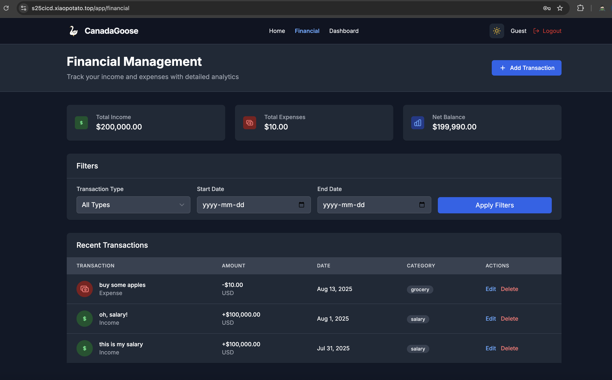
_Financial transactions management interface_

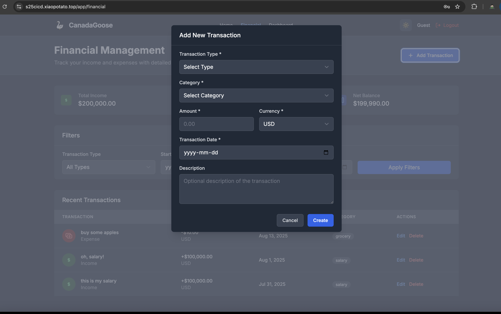
_Add new financial transaction form_

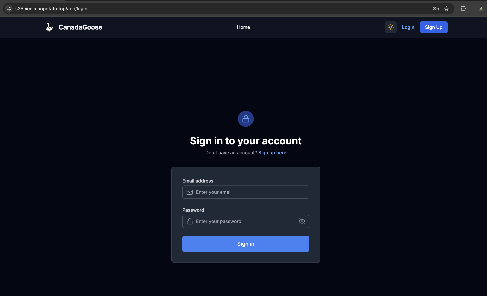
_Secure user authentication interface_

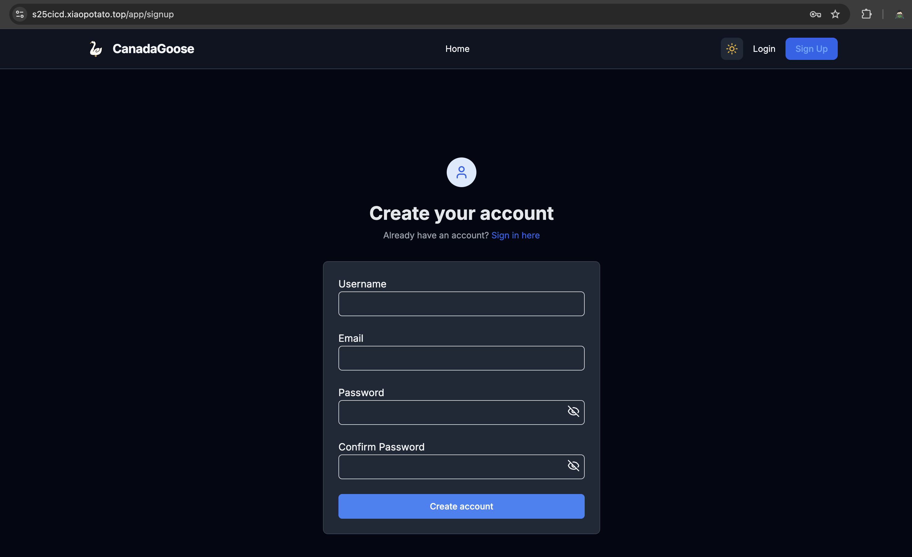
_User registration form_

## 🚀 Deployment

### Local Development

```bash
# Frontend
cd client && npm run dev

# Backend
cd server && npm run dev

# Database
docker-compose up -d
```

### Production Build

```bash
# Frontend production build
cd client && npm run build:prod

# Backend production package
cd server && ./scripts/build-production.sh
```

### AWS Production Deployment

```bash
# Automated full deployment
cd server && ./scripts/deploy-to-aws.sh

# Manual deployment
cd server && ./scripts/build-production.sh
# Then upload and deploy on EC2
```

## 🧪 Testing Strategy

### Frontend Testing

- **Unit Tests**: Vitest with Vue Test Utils
- **E2E Tests**: Cypress for modern browsers
- **Cross-Browser**: Selenium for comprehensive browser coverage
- **Coverage**: Built-in coverage reporting

### Backend Testing

- **Unit Tests**: Mocha + Chai
- **Integration Tests**: Supertest for API endpoints
- **Coverage**: NYC for code coverage analysis
- **Database Tests**: Connection and health check validation

## 📊 API Endpoints

### Authentication Routes (`/api`)

- `POST /api/register` - User registration
- `POST /api/login` - User authentication
- `GET /api/profile` - User profile (protected)
- `GET /api/healthcheck` - Server health status

### Financial Routes (`/api/financial`)

- `GET /api/financial/transactions` - Get all transactions
- `POST /api/financial/transactions` - Create new transaction
- `PUT /api/financial/transactions/:id` - Update transaction
- `DELETE /api/financial/transactions/:id` - Delete transaction

### Security Features

- Rate limiting on all API endpoints
- JWT token validation middleware
- Password complexity enforcement
- CORS protection for production

## 🌐 Production Environment

- **Frontend**: Static hosting via Nginx
- **Backend**: Node.js on EC2 with PM2
- **Database**: RDS MySQL in private subnet
- **Web Server**: Nginx reverse proxy with SSL
- **Monitoring**: PM2 process management + CloudWatch
- **CI/CD**: GitHub Actions automated deployment

### AWS Infrastructure Screenshots

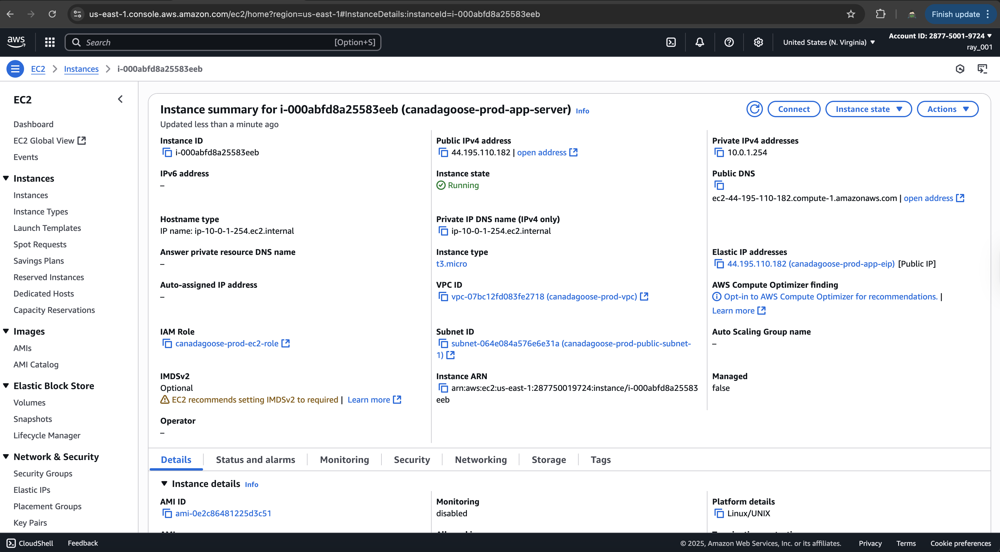
_EC2 instance management and monitoring_

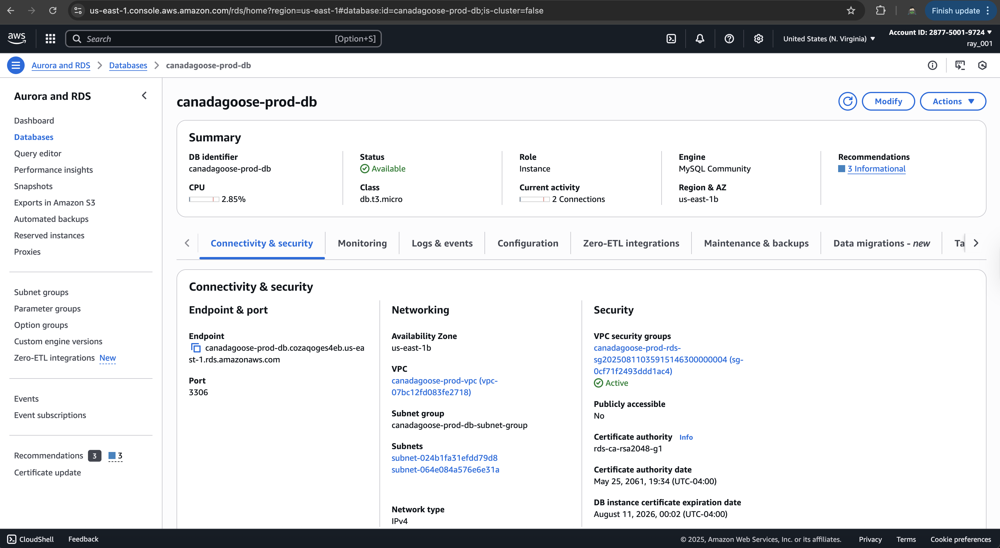
_RDS MySQL database instance configuration_

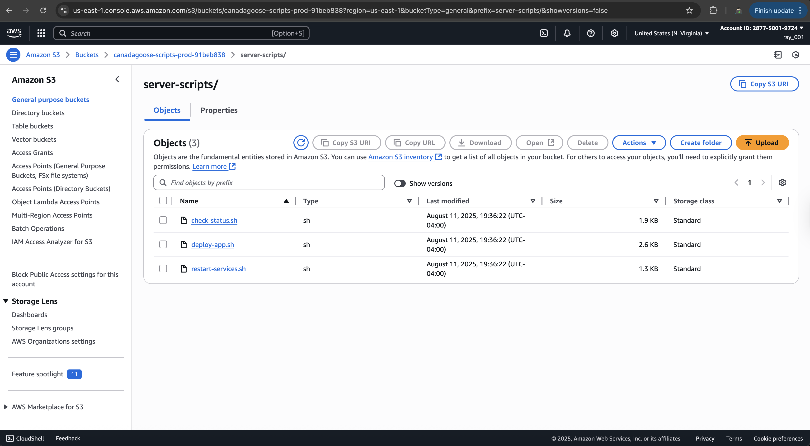
_S3 storage buckets for application assets_

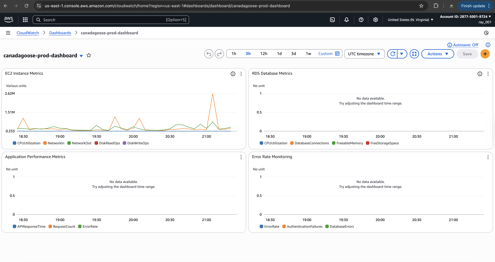
_CloudWatch monitoring and observability dashboard_

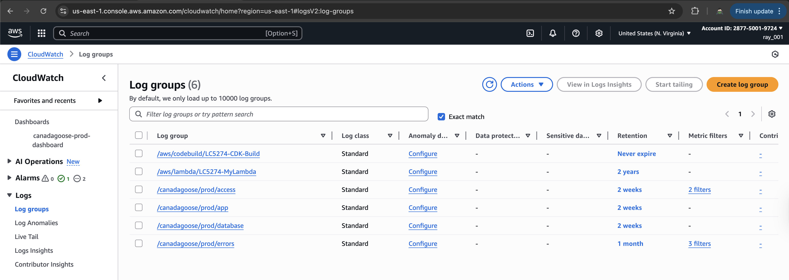
_CloudWatch log groups for application logging_

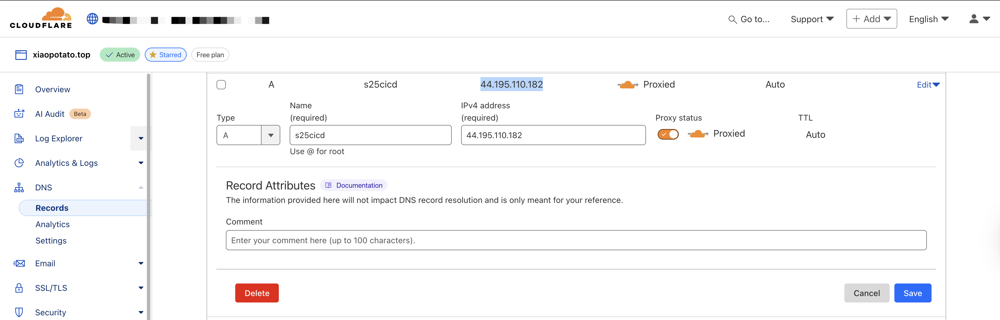
_DNS configuration and domain management_

### CI/CD Pipeline Screenshots

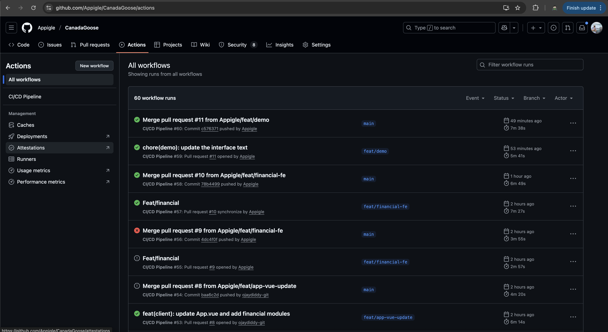
_GitHub Actions CI/CD pipeline overview_

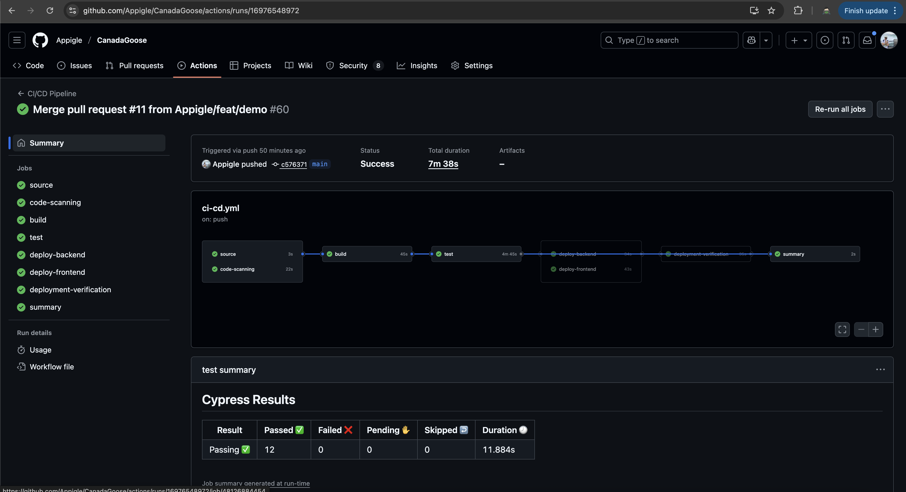
_Detailed view of GitHub Actions workflow execution_

## 🔧 Development Scripts

### Frontend Scripts

```bash
npm run dev              # Development server
npm run build            # Production build
npm run build:prod       # Production build with env
npm run test:unit        # Unit tests
npm run cypress:open     # E2E testing
npm run cypress:run      # Run E2E tests headlessly
npm run deploy:aws       # Deploy to AWS
```

### Backend Scripts

```bash
npm run dev              # Development server
npm run start            # Production server
npm run test             # Run tests
npm run test:coverage    # Tests with coverage
./start-dev-server.sh    # Local development setup
./scripts/build-production.sh    # Create deployment package
./scripts/deploy-to-aws.sh      # Full AWS deployment
```

## 📚 Documentation

- **Client Documentation**: `client/clientDocs/`
- **Server Documentation**: `server/serverDocs/`
- **Infrastructure**: `infra/README.md`
- **Deployment**: `infra/infraDocs/DEPLOYMENT_SUMMARY.md`
- **Server Management**: `infra/infraDocs/SERVER_MANAGEMENT.md`
- **Financial Feature**: `server/FINANCIAL_FEATURE_README.md`
